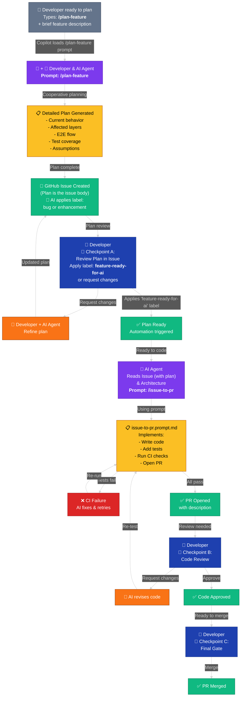

# AI Feature Delivery Workflow

Complete AI-assisted feature delivery: Developer + AI Agent create plan → issue posted with plan → AI implements → review checkpoints → merge.

## Workflow Summary

| Phase | Owner | Action | Invocation | Tool/Prompt |
|-------|-------|--------|------------|-------------|
| **1. Plan** | Developer + AI Agent | Developer types `/plan-feature` + brief description; cooperates with AI Agent to produce plan | `/plan-feature` | Copilot Chat prompt (`plan-feature.prompt.md`) |
| **2. Issue** | Developer + AI Agent | Developer reviews plan output; confirms AI Agent creates GitHub issue with plan as body | Manual | GitHub issue |
| **3. Label** | AI Agent (automated) | *(Automated)* AI Agent classifies issue and applies `bug` or `enhancement` label | Automated | GitHub labels (bug/enhancement) |
| **4. Plan Review** | Developer | 🔵 **Checkpoint A:** Developer reads plan in issue; applies `feature-ready-for-ai` label to approve (or edits issue and re-plans if changes needed) | — | GitHub issue labels |
| **5. Implement** | AI Agent | *(Automated)* AI Agent reads issue, creates branch, implements feature, opens PR | `/issue-to-pr` | Copilot Chat prompt (`issue-to-pr.prompt.md`) |
| **6. CI** | Automation | *(Automated)* Tests, lint, and security checks run on the PR | — | GitHub Actions |
| **7\. PR Review** | Developer | 🔵 **Checkpoint B:** Developer reviews PR code and tests; approves or requests changes | — | GitHub PR review |
| **8\. Merge PR** | Developer | 🔵 **Checkpoint C:** Developer confirms CI passes and merges the PR | — | GitHub merge |

## Workflow Diagram

