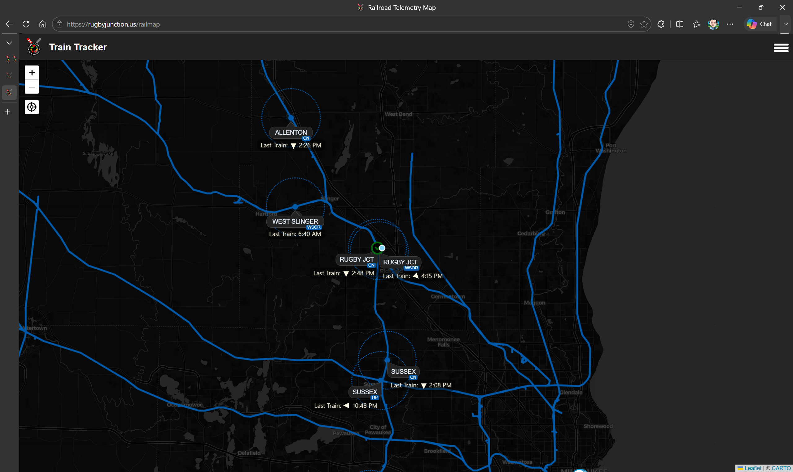

# Rugby Junction Train Tracker

Rugby Junction Train Tracker is a freight train tracking application built to fill the void left by the deprecation of ATCS Monitor.



## Repository Layout

- `Web/web.client`: React 19 + Vite frontend (map UI, auth screens, admin views, SignalR client).
- `Web/Web.Server`: ASP.NET Core backend API + SignalR + EF Core + hosted background services.
- `Services`: shared telemetry/deserialization/throttling/resilience library.
- `ConsoleApp`: desktop telemetry client.
- `Services.Models`: shared models/configuration.
- `Web/Web.ServerTests`: server unit and service tests.
- `Web/Web.Server.IntegrationTests`: backend API/auth/integration tests.
- `Services.UnitTests`: shared services tests.

## Prerequisites

Install the following tools:
- .NET SDK (for building and running backend projects)
- Node.js + npm (for the frontend)
- Visual Studio Code with C# and JavaScript/TypeScript support

## Start Locally (One Click)

This repository includes a one-click full-stack launch profile in `.vscode/launch.json` named **Full Stack (One Click)**.

What it starts:
- Backend API: `Web/Web.Server/Web.Server.csproj` (launch profile: `http`)
- Frontend UI: `npm --prefix Web/web.client run dev`

Port alignment in this one-click setup:
- Backend API URL: `http://localhost:5081`
- Frontend dev server: Vite default from this repo config (typically `https://localhost:53848`)
- Frontend is configured at launch to call `VITE_API_URL=http://localhost:5081`

How to run:
1. Open this repository in VS Code.
2. Open **Run and Debug**.
3. Choose **Full Stack (One Click)**.
4. Press **Start** (or `F5`).

How to stop:
- Press the red stop button in VS Code; both backend and frontend stop together (`stopAll: true`).

## High-Level Architecture Overview

### Backend (`Web/Web.Server`)

- REST controllers expose API contracts.
- Services and rule-engine classes implement business behavior (telemetry filtering, map-pin logic, auth, tracked pin lifecycle).
- Repositories and EF Core entities persist data to SQLite.
- SignalR hub publishes real-time updates to connected clients.
- Hosted background services perform cleanup and operational tasks.

### Frontend (`Web/web.client`)

- React-based UI for rail map, admin tools, and authentication flows.
- API calls are managed through client API/service modules.
- SignalR subscriptions update map state in real time.
- UI logic handles freshness and refresh behaviors for map pins and related telemetry views.

### Shared Services (`Services`)

- Deserializers for telemetry packet formats.
- Throttling and resilience policies.
- Subscriber integrations and support utilities used by non-web components.

## Data Flow (Conceptual)

1. Telemetry enters backend endpoints/background paths.
2. Rule engines validate/filter packets.
3. Map pin logic resolves beacon/subdivision context and updates current state.
4. Persistence layer writes current and historical records.
5. SignalR broadcasts updates.
6. Frontend refreshes map/UI in near real time.

## Common Build/Test Commands

From repository root:

```bash
dotnet build RugbyJunctionTrainTracker.sln
dotnet test Web/Web.ServerTests/Web.Server.Tests.csproj
dotnet test Web/Web.Server.IntegrationTests/Web.Server.IntegrationTests.csproj
dotnet test Services.UnitTests/Services.UnitTests.csproj
npm --prefix Web/web.client run build
```
